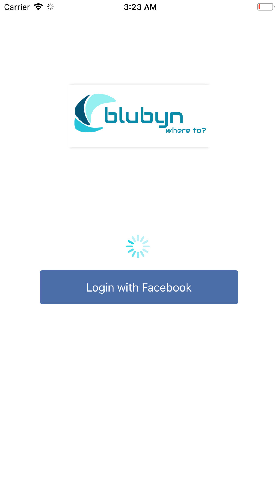
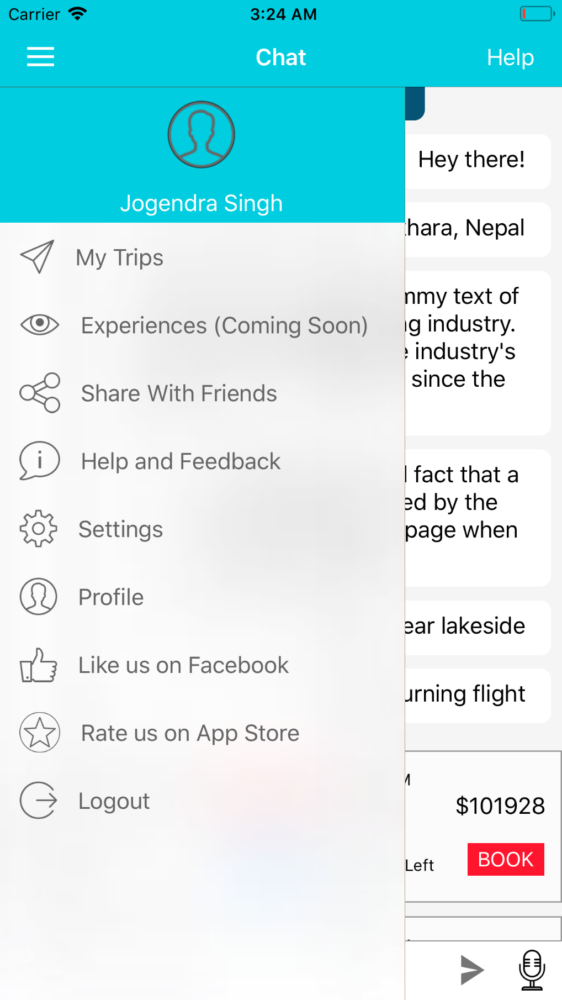
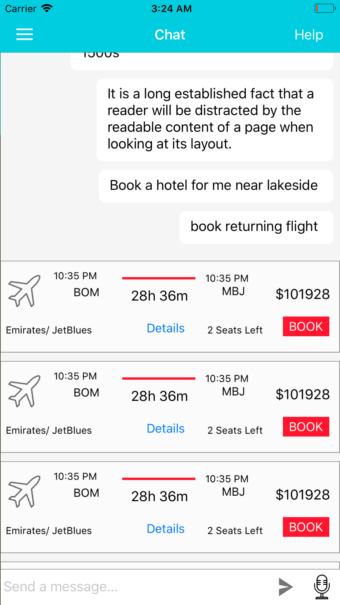
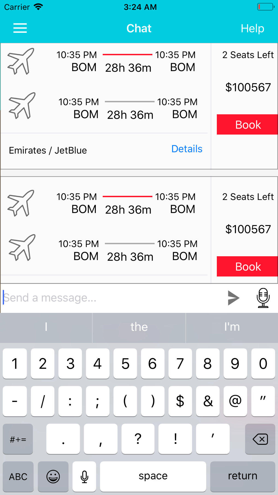
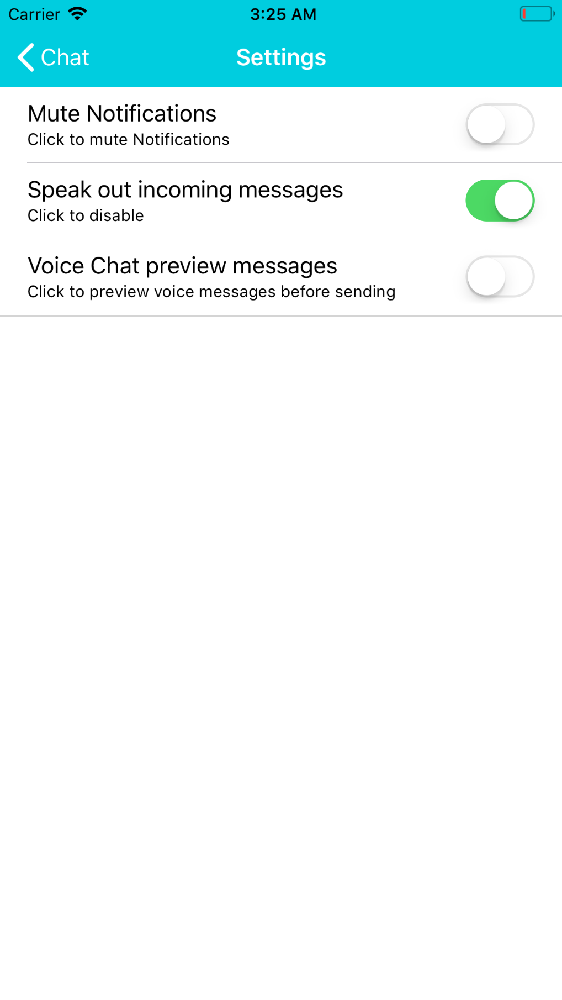
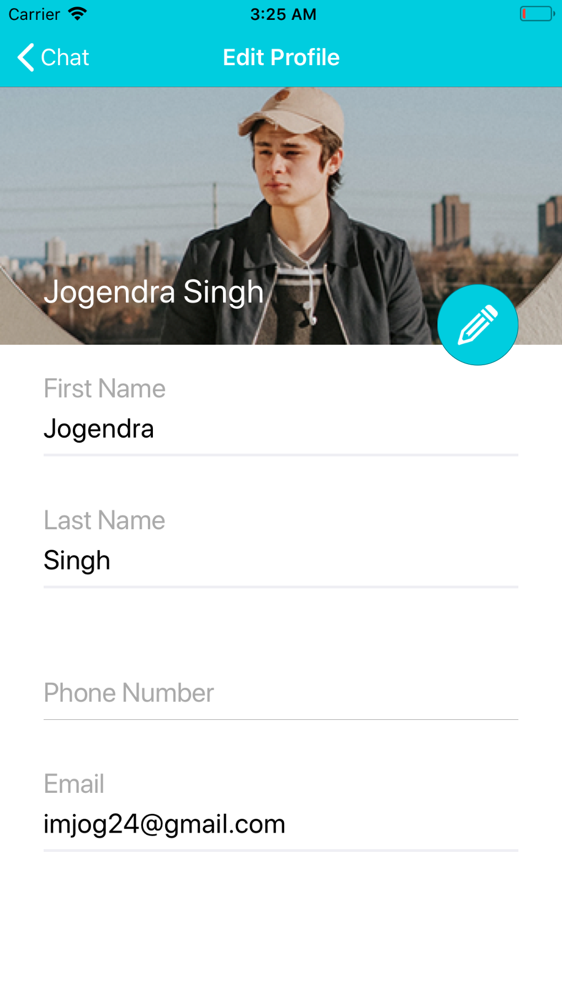
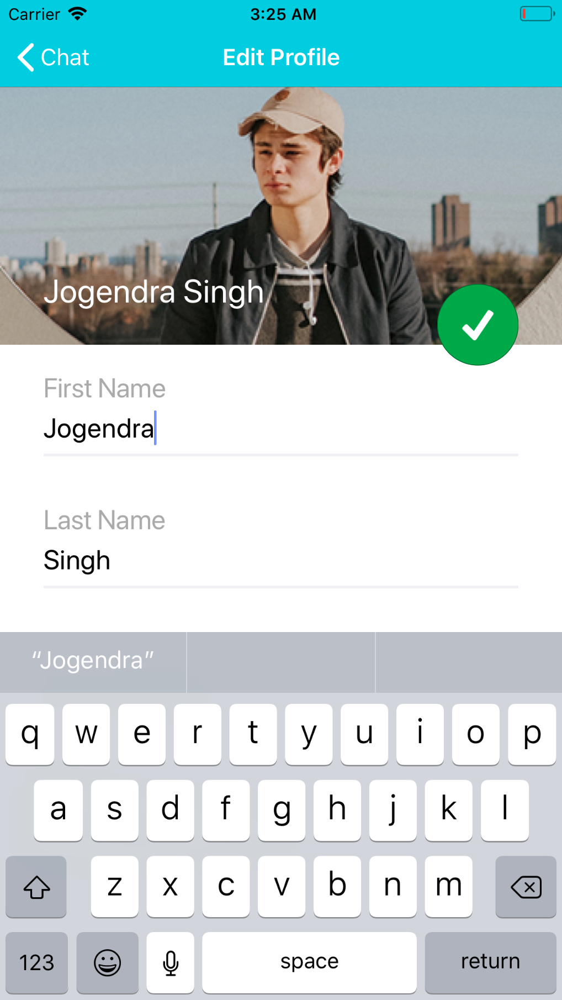

# Blubyn iOS
This repository contains iOS version on Blubyn App.

### Installation

1. Clone the repo via git clone command.
```git clone https://github.com/imjog/blubyn-ios.git```
2. Run the following command to install all the third-party libraries.
```pod install```
3. Open in Xcode:
```open Blubyn.xcworkspace```

## Screenshots

<table>
  <tr>
    <td></td>
    <td></td>
    <td></td>
  </tr>
  <tr>
    <td></td>
    <td></td>
    <td></td>
  </tr>
  <tr>
    <td></td>
    <td></td>
  </tr>
</table>

### Coding standards

Please follow the following guides and code standards:
[Swift Style Guide](https://github.com/linkedin/swift-style-guide)

### Contact

For any further details contact: [jogendra.kumar.phy15@iitbhu.ac.in](mailto:jogendra.kumar.phy15@iitbhu.ac.in)
